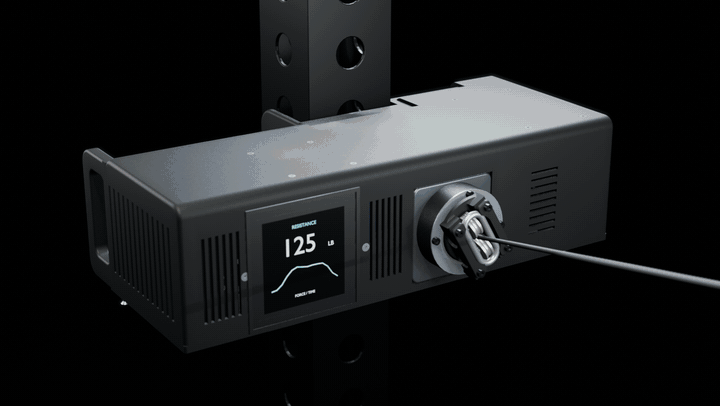
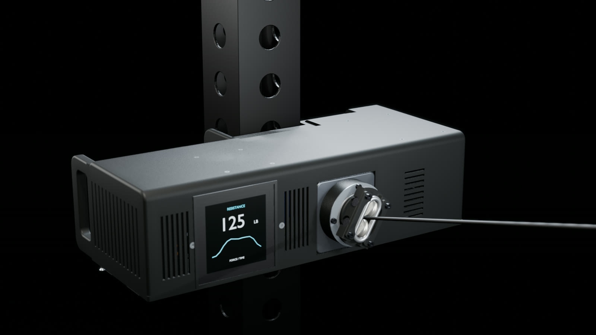
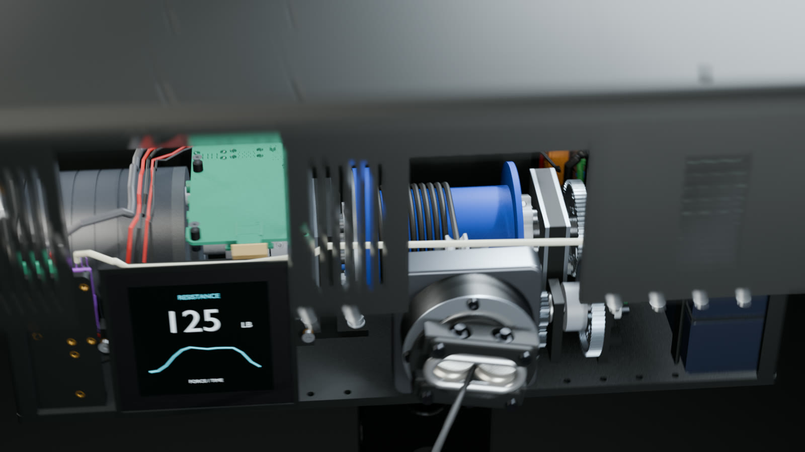
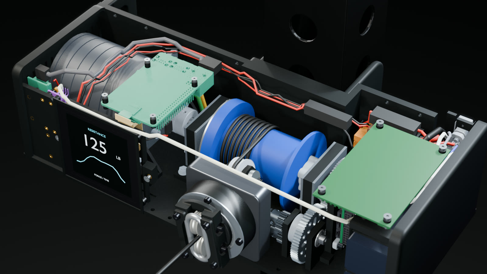
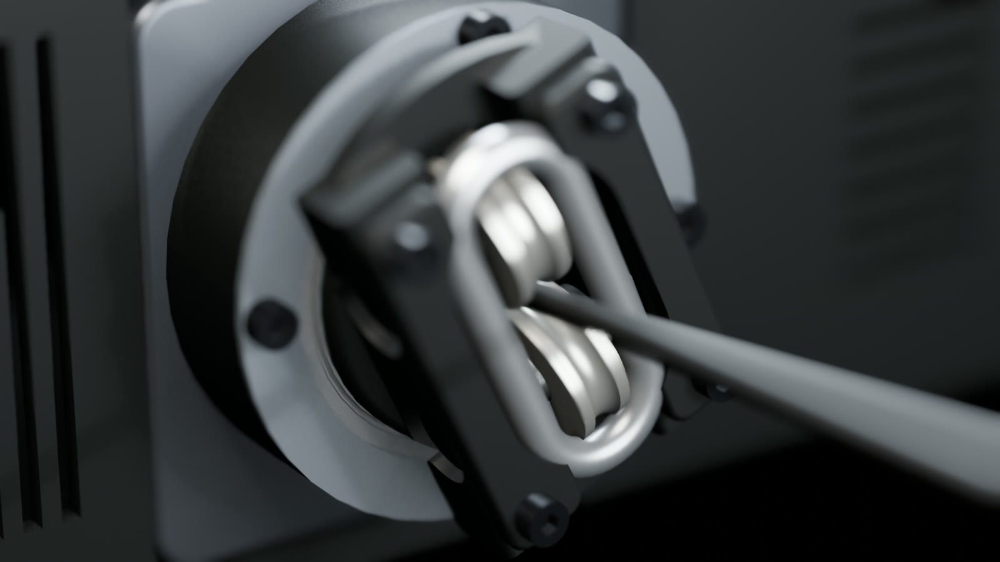
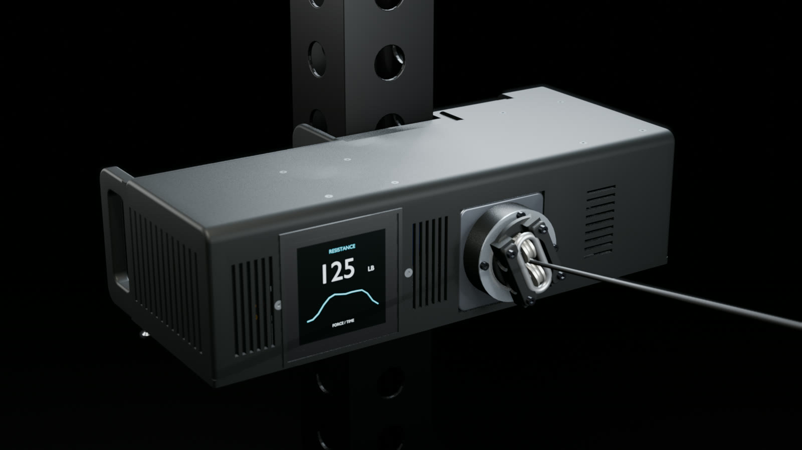
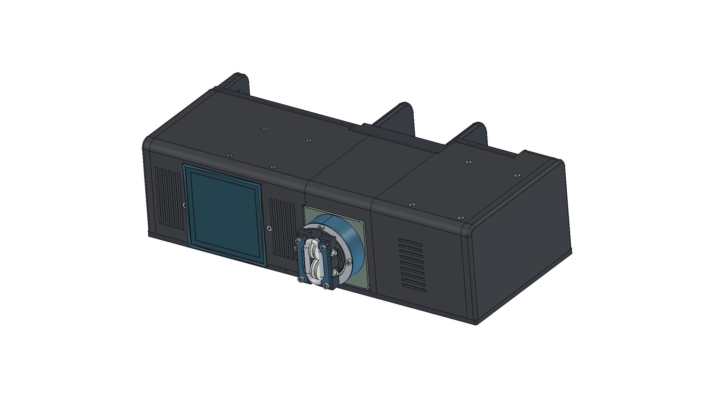
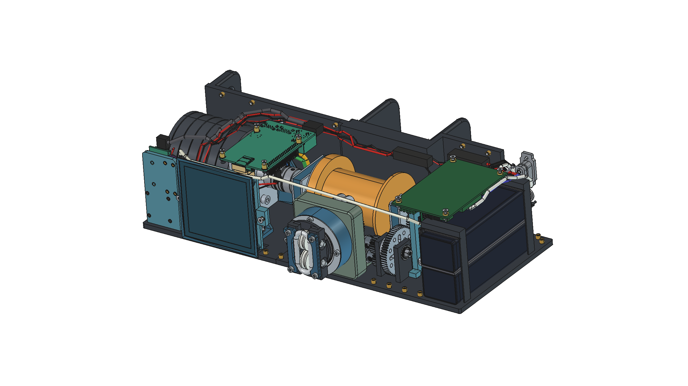

<h1 align="center">KinetiqGym</h1>

<b>An open-source, battery-powered cable trainer you can print, build and modify.</b> 
<a href="https://kinetiqgym.com">kinetiqgym.com</a> · <a href="docs/build.md">Build</a> · <a href="docs/wiring.md">Wiring</a> · <a href="bom/BOM.md">Parts</a> · <a href="cad/">CAD</a> · <a href="images/animation.mp4">Video</a>

A direct-drive motor turns a rope drum, a geared level-wind fairlead lays the rope, and the controller sets the resistance.
Designed to be 3D printed (with two drilled aluminium bars) or machined, and to be adapted: other motors, other batteries,
a rotary encoder instead of the touch screen.

> **Status: v0.1.0, prototype design. Not yet built or load-tested.** Read [SAFETY.md](SAFETY.md) before building.
> The control app is not included yet.

| | |
|---|---|
|  |  |
|  |  |
|  |  |

Renders: Blender (Eevee) from the CAD in this repository, the mechanism moving at its real gear ratios; the display
content is illustrative. Bottom row: the FreeCAD assembly.

## At a glance

| | |
|---|---|
| Drive | direct-drive outrunner (reference: about 50 Kv, 13 N·m peak) on an ODrive Pro |
| Resistance | 100 lbf sustained design target; physical load and thermal validation pending |
| Rope | 3.175 mm (1/8 in), 2.11 m tracked payout + 3 dead wraps; design load 890 N (200 lbf) |
| Fairlead | worm-driven carrier (1/53 of a turn per drum turn) with a sheave and a U625ZZ pulley exit |
| Battery | 2 x 5S LiPo (Thunder Power TP2700-5SR70) in series, 30-42 V, JBD 10S BMS; regenerative braking charges it |
| Controls | Raspberry Pi 4 + 4 in touch screen, Teensy 4.0 on CAN to the ODrive |
| Size | about 371 x 143 x 112 mm, about 6 L, about 5.6 kg (estimate) |
| Parts | 28 printed parts, 136 screws / nuts / washers / inserts, about 55 purchased components |

## What is in this repository

| Folder | Contents |
|---|---|
| [`cad/freecad/`](cad/freecad/) | FreeCAD 1.x: the assembly, one file per part **with its full feature history**, and a drivetrain motion study |
| [`cad/step/`](cad/step/) | every part as STEP, plus one assembly STEP per variant |
| [`cad/dxf/`](cad/dxf/) | 2-D profiles of the flat parts |
| [`cad/vendor/`](cad/vendor/) | where to download the supplier CAD (bearings, gears, boards...) that cannot be redistributed |
| [`print/`](print/) | STL for every printed part, with material, orientation and inserts; fit coupons |
| [`bom/`](bom/) | bill of materials: purchased parts, hardware counts, metal |
| [`docs/`](docs/) | [build](docs/build.md), [wiring](docs/wiring.md), [electronics and firmware setup](docs/firmware-setup.md), [printing](docs/printing.md), [modifying](docs/modifying.md) |
| [`site/`](site/) | Website, editable itemized budget and reference pages |
| [`software/`](software/) | Pi, Teensy and companion software status (implementation pending) |
| [`source/`](source/) | the Python (CadQuery) scripts that generate the CAD |

Two variants share the same enclosure: **printed** (PA-CF bottom plate on two aluminium flat bars) and **cnc**
(aluminium bottom plate).

## Licences

- Hardware (CAD, drawings, print files): **CERN-OHL-S-2.0**
- Documentation and images: **CC BY-SA 4.0**
- Software and scripts (`source/`): **GPL-3.0**

See [LICENSE.md](LICENSE.md). Supplier CAD is not included; each supplier's own terms apply to the files you download.

## Contributing

Issues and pull requests are welcome: see [CONTRIBUTING.md](CONTRIBUTING.md).

## Development status and budget

See [the roadmap](docs/roadmap.md) for release milestones and [the website](https://kinetiqgym.com/#parts) for itemized purchasing prices, dated sources and editable fabrication allowances. The budget is a planning estimate, excluding tax, shipping, tools, labor and the rack.
