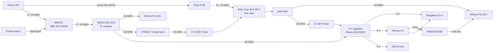

# Wiring

Every wire below is modelled in the CAD (`WIRE_*` parts, routed through the enclosure with their real insulation diameter),
so the lengths are the routed lengths; add 10-15 % for the terminations. Gauges are the minimum.

## Power path

Every return goes through the BMS P- (the WAGO), so the BMS can switch everything off. Charging enters at the main fuse's
line stud through its own 7.5 A fuse (it bypasses the 40 A fuse; the BMS still controls it).

## Wire list

| Wire | Gauge | Route / ends | Length |
|---|---|---|---|
| DSI ribbon 15way FFC | FFC | Display ribbon: 15-way 1 mm FFC from the screen connector, behind the screen stand, up the back of the screen to the Pi DSI port. | - |
| pack plus B+ to fuse line 10AWG | 10AWG | Pack B+ (EC5 on the pack lead) to the main fuse line stud (ring terminal inside the holder). | 172 mm |
| series link A+ to B- 10AWG | 10AWG | Series link between the two 5S packs (EC5 pair), in the back step. | 53 mm |
| pack minus A- to BMS B- 10AWG | 10AWG | Pack A- (EC5) to the BMS B- pad (soldered; pad position is the mock's). | 124 mm |
| ODrive DC+ from fuse load 10AWG | 10AWG | Main fuse load stud to ODrive DC+ (TB005 pole 1; ferrule). | 30 mm |
| ODrive DC- from WAGO 10AWG | 10AWG | WAGO port 1 to ODrive DC- (TB005 pole 2; ferrule). | 42 mm |
| BMS P- to WAGO 10AWG | 10AWG | BMS P- pad to the WAGO (port 2). | 164 mm |
| motor phase C 12AWG | 12AWG | Motor phase C: out of the lead-exit endcap, through the 12 mm grommet in the face plate, to TB005 pole 5 (ferrule). Gauge and exit point to confirm on the motor. | 304 mm |
| motor phase B 12AWG | 12AWG | Motor phase B: out of the lead-exit endcap, through the 12 mm grommet in the face plate, to TB005 pole 4 (ferrule). Gauge and exit point to confirm on the motor. | 315 mm |
| motor phase A 12AWG | 12AWG | Motor phase A: out of the lead-exit endcap, through the 12 mm grommet in the face plate, to TB005 pole 3 (ferrule). Gauge and exit point to confirm on the motor. | 280 mm |
| charge plus XT60 to inline fuse 16AWG | 16AWG | Charge port + (upper cup, per the panel marking) to the 7.5 A inline fuse. | 40 mm |
| charge plus inline fuse to line 16AWG | 16AWG | 7.5 A inline fuse to the main fuse line stud (charging bypasses the 40 A fuse, the BMS still switches it). | 79 mm |
| charge minus XT60 to WAGO 16AWG | 16AWG | Charge port - (lower cup) to the WAGO (port 3). | 126 mm |
| regulator feed fuse load to inline fuse 18AWG | 18AWG | Main fuse load stud to the 3 A inline fuse. | 147 mm |
| regulator VIN+ from inline fuse 18AWG | 18AWG | 3 A inline fuse to the regulator VIN (screw terminal on its perfboard). | 338 mm |
| regulator VIN- to WAGO 18AWG | 18AWG | WAGO port 4 to the regulator GND in. | 412 mm |
| 5V Pi plus 20AWG | 20AWG | Regulator 5 V out to Pi GPIO pin 2. | 131 mm |
| 5V Pi minus 20AWG | 20AWG | Regulator GND to Pi GPIO pin 6. | 131 mm |
| 5V fan plus 24AWG | 24AWG | Regulator 5 V out to the ODrive fan (fan lead extended). | 411 mm |
| 5V fan minus 24AWG | 24AWG | Regulator GND to the ODrive fan. | 413 mm |
| 5V Teensy VIN 22AWG | 22AWG | Regulator 5 V out to Teensy VIN (cut the VIN-VUSB pad). | 77 mm |
| 5V Teensy GND 22AWG | 22AWG | Regulator GND to Teensy GND. | 91 mm |
| Teensy to CAN board 4x26AWG | 4x26AWG | Teensy CAN TX/RX, 3.3 V and GND to the CAN transceiver board (short bundle on the front plate). | 26 mm |
| CAN bus to ODrive twisted pair | twisted_pair | CAN H / CAN L / GND (twisted pair + drain) from the CAN board terminal to the ODrive CAN header, in front of the BMS. | 350 mm |
| USB Teensy to Pi | - | USB cable, Teensy (micro-USB, right angle) to the Pi upper USB-A port (right angle). | 177 mm |
| balance lead pack A | - | Pack A balance lead (cells 1-5) to the BMS balance header. | 177 mm |
| balance lead pack B | - | Pack B balance lead (cells 6-10) to the BMS balance header. | 128 mm |
| BMS NTC lead | - | BMS NTC lead to the probe on pack B. | 108 mm |
| power switch to BMS pair | - | Power switch to the BMS soft-switch input (twisted pair). | 128 mm |

## Notes

- **Fuses must be rated 58 V** (Littelfuse BF1 MIDI 40 A, Littelfuse 997 MINI 3 A and 7.5 A). Common 32 V automotive fuses are not.
- EC5 plugs on the pack leads are the service disconnect: plug in with the BMS switched off.
- WAGO 221-615 is rated about 30 A (UL); the peak pull is about 28 A for short reps.
- Teensy: cut the VIN-VUSB pad (powered by the regulator and connected to the Pi by USB).
- Motor phase leads: gauge and exit point depend on your motor; the model assumes 12 AWG through a 12 mm grommet.
- Crimp ferrules on every wire into the ODrive terminal block; ring terminals on the fuse-holder studs.
