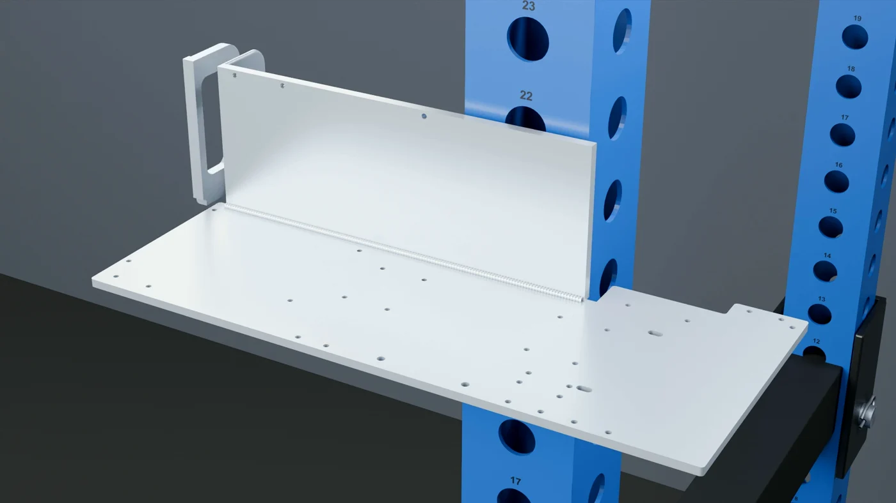
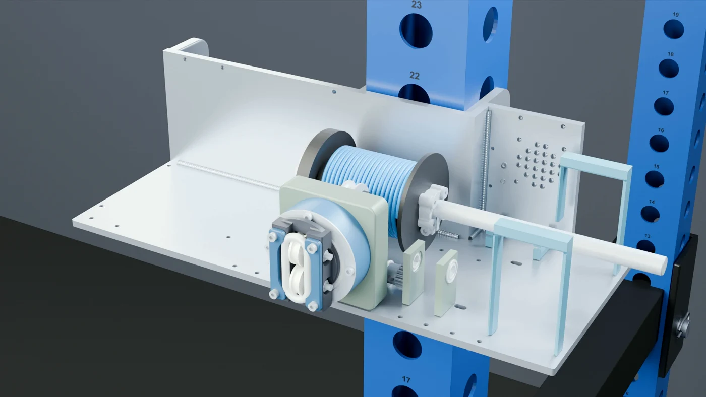
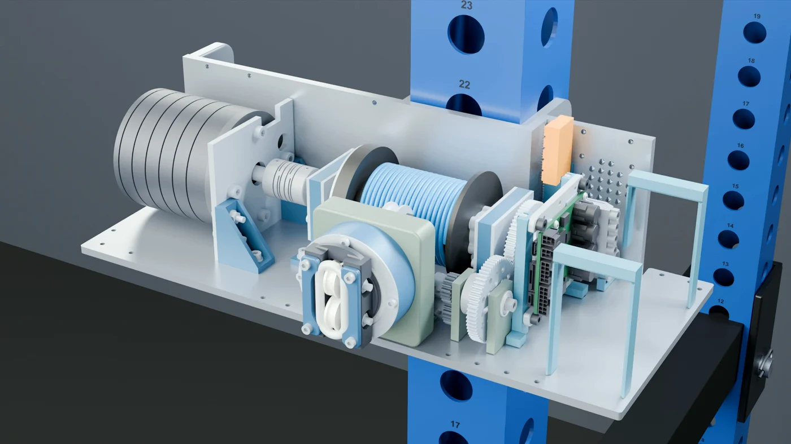
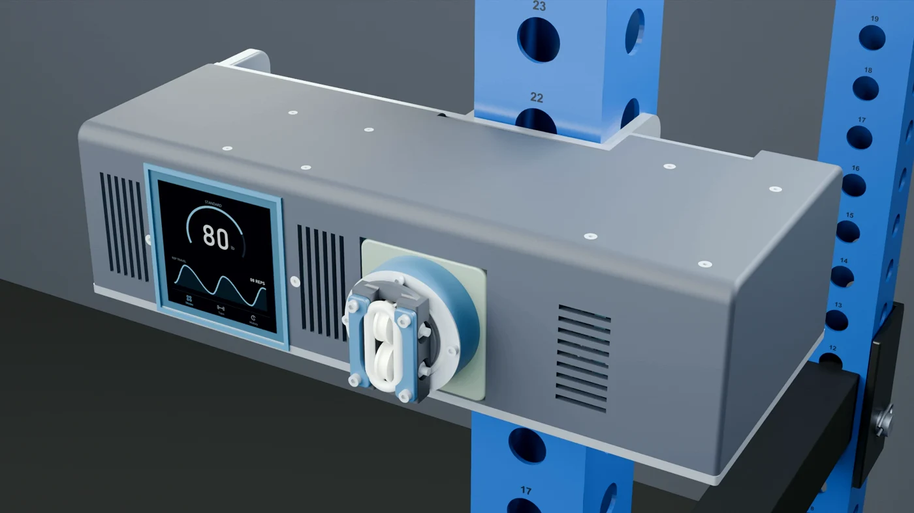

# CNC build: illustrated preview

**Build instructions and updated CAD are upcoming.** These stills are taken from the CNC assembly segment of the KINETIQ Blender animation. They explain the proposed layout; they are not a confirmed fabrication or assembly procedure. The earlier prototype files in the repository and this film may show different revisions.

## 1. Aluminum structure and welded joints

The bottom and rear plates are aluminum. Separate plate connections and the rack-mount cheeks are shown as weld steps. The mount is attached before the hitch pin enters the rack. Final drawings, weld specifications and inspection details are pending.

## 2. Drum, bearings and fairlead

The drum and fairlead assemble at their installed positions. The illustration shows the shaft, bearing supports, transmission and wound rope together. Updated drum dimensions and fairlead geometry will be documented with the coordinated CAD release.

## 3. Motor, electronics and power

The drive and electronics surround the rope mechanism. The proposed battery removal path slides the packs into their saddles. Final wiring, fastener details, control firmware and validation procedures are still being developed. See the [draft wiring reference](wiring.md) for the earlier prototype.

## 4. Printed enclosure and touchscreen

The printed cover and carry handle complete the aluminum build. The touchscreen in the animation is an interface concept. Fit, clearances and installation details remain part of prototype development.

## Follow the next release

View the [public repository](https://github.com/TrentIndeed/kinetiqgym), [contribution guide](CONTRIBUTING.md) and [project roadmap](roadmap.md). The confirmed parts list, build instructions, updated models, Pi app and Teensy programs will be published as they become ready.

Animation imagery © KINETIQ project, shared with the project documentation under CC BY-SA 4.0. Depictions of third-party components identify their role in the concept; they do not imply endorsement.
